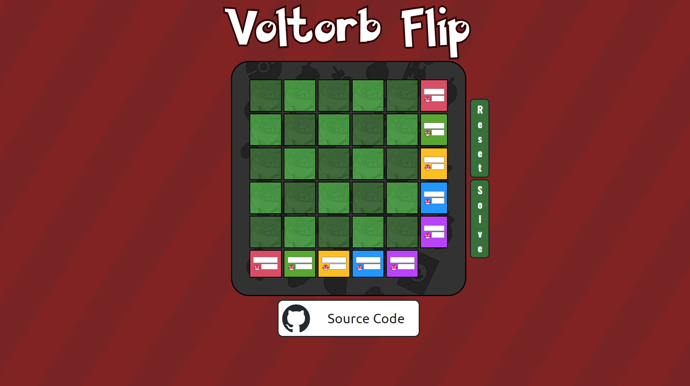

# Voltorb Flip

The idea of this repository is redoing the old code of my VoltorbFlip-Legacy solver, in order to make it responsive, easier to understand, and fully functional.

## Old Webpage (no functionality)

    <video width="600" controls>
        <source src="./.github/assets/VoltorbFlip-Legacy_video.mp4">
        
    </video>

